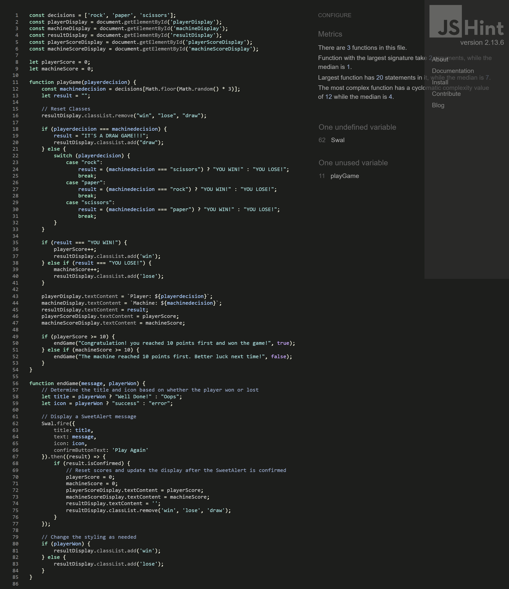

# *ROCK PAPER SCISSORS GAME*
Rock-paper-scissors is a simple hand game usually played between two people. The game is often used as a decision-making tool, much like flipping a coin or drawing straws. It is popular worldwide and known by many different names.The app Game is used to make simple decision in a fair manner.

The site can be accessed by this [link](https://ebuka-martins.github.io/Rock-Paper-Scissors-Game-/)


## User Stories of The Rock Paper and Scissors Game

### Overview
As First Time User of the Rock, Paper, Scissors game website, I want to enjoy a simple and engaging gameplay experience where I can compete against a computer. The game should be easy to understand and play, provide immediate feedback, and keep track of scores. The first player to reach 10 points wins.

### First Time User Goal

##### 1. Discover The Game
- As a first-time user, I want to easily understand the purpose of the website from the welcome page, so I know what to expect from the game.
- I want clear instructions on how to start and play the game.

##### 2. Engage With The Game
- I want a straightforward way to access the game by "Click Here to Start The Game button" without needing to sign up or log in.
- I want the interface to be intuitive, with large buttons representing the choices of rock, paper, and scissors, to easily understand how to play.

##### 3. Experience with the Game

- I want immediate visual and textual feedback on the outcome of each round (win, lose, draw).

### Returning User Goals

##### 1. Brief Access of the Game

- As a returning user, I want to quickly access the game page without navigating through multiple screens, so I can resume playing without delay.
##### 2. Brief Challenge of the Game
- I want to challenge myself against the computer, aiming to improve my score and strategies over time.

### Regular User Goals
- As a regular user, I want a consistent and reliable gaming experience every time I visit the site, with no bugs or unexpected changes in gameplay mechanics.

#### Additional Consideration of the Game
- The game should work seamlessly on different devices, including desktops, tablets, and smartphones.

## Features
### Home/Index Page
- Main page has a white color header containing the Title of the game "Rock Paper Scissors Game".
- The header also contains a cadet color background whith a title capture ontop. 
- The main page contains a brief white welcome text in space cadet color of what the gane is all about and what to except for whoseover get to score 10 first.
- The Main page also contain a button with a hovering color attribute "Click Here To Start The Game".   
 - Main page also contain the Footer Icon that has a live link to My GitHub page.

 

### Game Page 
- The game page has a white background area where the game is centered at the middle of the page.
- It consist of three playgame buttons of (rock, paper and scissors ) that are clickable
- The playgame buttons has a light-blue hovering attribute when the cursor are being slide over them
- "win, lose or draw" are displayed immediately any buttons are clicked.
- The game page also has a display input that comprises of both the player and machine score list.
- Finally, either a congratulatory message that appears on the screen "you won the game" or a better luck next time message that emanates when you lose the game.


## Technologies Used
 - [GitHub](https://github.com/) was used to host the code of the website.
 - [Gitpod](https://gitpod.io/) was used as the main tool to write and edit code.  

 ## Design 

  ### Color Design
  

  - Green color was used as the player score output.
  - Red color was used as the machine score ouput.
  - Sapphire color was used as the border and hovering color that emanate when the cursor is placed on the button of the home/index page.
  - The space cadet color was used as the background color of the index/home page.
  - Azure color was used as the left side color of header.
  - The white color is used as the text color of the header, background text and the game page background.
  - The yellow color for "YOU DRAW" that pops up at the game page when the game is drawned between the player and machine.
  - Ralsin black color was used as the right side color of the header.

  ## Typography

   - Roboto google font was used as the main font of the website in order to increase readability of the content on the pages.

  
  
  ## Bugs 
  ### Solved bugs
  - on the home/index page validation," button" attribute was used on the "a" and error was detected
  ```html
  <button>
        <a href="game.html" aria-label="go to rock page" class="main-index">Click Here to Start The Game</a>
    </button>
  ```
   *Solution:* I made was to remove the "button" attribute and used "a" attribute directly without removing indenting them to the buton directly.
   ```
    <a href="game.html" aria-label="Go to Rock Paper Scissors game page" class="main-index button">Click Here to Start The Game</a>
   ```
 - on the css style validation, an error was detected, because 20px was used on font-weight in the wildcard of the css.

   ```
   * {
   
    font-weight: 20px;
    }

   ```

   *Solution:* I made was to remove the font-weight from the wildcard asterick in the css style.


- Using jshint validator an error was detected because Esversion6 and the "use strict"; was not added, and semi-colon was not included at the end of all statement.
```
js{
    "use strict";
}

```
 *Solution:* I made was to include semi-cilon at the end of all the statements and make sure that Esversion 6 was rsolved.

## Texting
  ### COMPATIBILITY:

  - In order to confirm the correct functionality and appearance across devices, the website was tested on the following browsers: Chrome, Firefox and Microsoft Edge.

- Chrome Brower:
 

- Edge Browser:
 

 - Mozilla Firefox
 


  ## Devtools Responsive Testing
 - In order to confirm the responsivenes of the website across devices, the website was checked with devtools implemented in Chrome, Microsoft Edge and Firefox browsers.

 ## Validator testing
 + ### HTML
   - Initially an errors was found at the home/index page, which was resolved accordingly by checking through for errors.

   ### Home page Section
- No errors or warnings were found when passing through the official W3C validator.


 ### Game page Section
- No errors or warnings were found when passing through the official W3C validator.


### CSS 
- No errors were returned when passing through the official W3C CSS Validator (Jigsaw) after it has been resolved accordingly by removing font-weight from asterick/ wildcard.


### Javascript
- No errors or warnings were found when passing through the official [JSHint](https://jshint.com/) validator except that semic-colon that was added at the end of every statement, and Esversion6 that has been resolved accordingly.
- Furthermore, the codes are working effectively.



 ## Wave Test Report
 - wave test report was used to test the webpage performance and functions in different environments or at different times.

 

 ## Lighthouse Test Report
 - Using lighthouse in devtools for my website, I confirmed that the website is performing well, accessible and colors and fonts chosen are readable.
  ### Home Page Section
  

   ### Game Page Section
  
   


 ## Validation

   ### HTML
   - No errors or warnings were found when passing through the official W3C validator

 ### Home Page Section
 

 ### Game Page Section
  

  ### CSS
   - No errors were returned when passing through the official W3C CSS Validator (Jigsaw).
    


  ## Deployment

 ### Deployment to GitHub Pages

  - The site was deployed to GitHub pages. The steps to deploy are as follows: 
  - In the GitHub repository, navigate to the Settings tab.
  - From the general navigate to pages.
  - In the pages, from the source drop down menu, select the main branch, then click save.
  - Once saved, the link will be created to the website.   
    The live link can be found [here](https://ebuka-martins.github.io/Rock-Paper-Scissors-Game-/)

   ### Local Deployment
   - In order to make a local copy of this project, you can clone it.
  - In your IDE Terminal, type the following command to clone my repository:

 - `git clone https://github.com/Ebuka-martins/Rock-Paper-Scissors-Game.git`

 - Alternatively,  if you use Gitpod, you can [link](https://ebuka-martins.github.io/Rock-Paper-Scissors-Game/) which will start the Gitpod workspace for you.

 ## Credits Accolade

 ### Content 
 
 - The inspiration was gotten from BroCodez who I have been following for almost 1 year and I have learnt alot from.
 - The name of the game "Rock Paper Scissors Game" was gotten from [BroCodez](https://www.youtube.com/@BroCodez).
 - my inspiration was gotten from [Code Institute](https://codeinstitute.net/ie/) love Maths lectures.
 - GitHub icon in the footer was taken from [Font Awesome](https://fontawesome.com/)
 - The Roboto font was gotten from [Google Font](https://fonts.google.com/).

- The favicon logo generator used for this website was gotten from [favicon](https://favicon.io/).
 - The media query screen was gotten from an inspiration gottern [w3school](https://www.w3schools.com/html/default.asp).
  - The group color text logo munched for this README was gotten frm [color co](https://coolors.co/).
  - The website used to screenshot the full website used on features for README [thum io](https://www.thum.io/).
  - The tools used to screenshot various device breakpoint for responsive design for README was gotten from [am i responsive](https://ui.dev/amiresponsive).
  
 ## Acknowlegement
 - I give Special thanks to my wife Precious Chidimma, my brother John Paul and my parents who has been a great support to me all through this project.
 - [Vernell Clark](https://github.com/VCGithubCode) is my friend and he has been a great support to me throughout this project.
 - [Jubril Akolade](https://github.com/Jubrillionaire) was a great mentor to me throughout this project.
 -  [Code Institute](https://codeinstitute.net/) tutors and Slack community members for their support and help.
 -  [Love Math](https://codeinstitute.net/) tutors and Slack community members for their support and help.
 - [Ovundiano](https://github.com/Ovundiano) was also my friend who has been very supportive to me throughout this project. 


